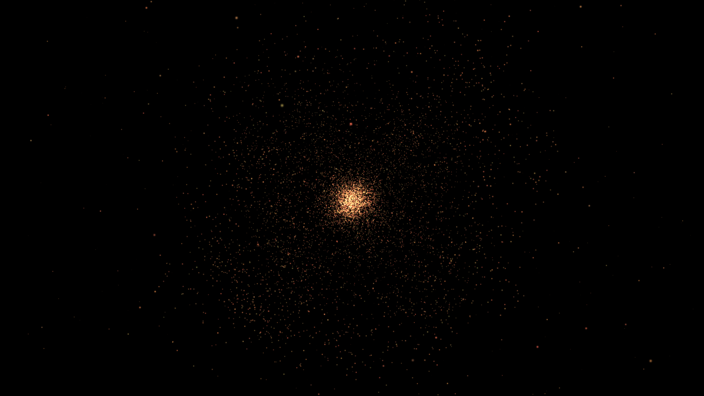

N-Body-problem-CUDA
===================

Learning project to test some optimizations in CUDA programming.

### What is it?

It is a little project to better understand optimizations that can be done in gpu programming. Maybe it can help you, maybe not. This project comes as a synthesis of what I've learned from the NVIDIA documentation, especially this: [N-Body problem using CUDA](http://docs.nvidia.com/cuda/samples/5_Simulations/nbody/doc/nbody_gems3_ch31.pdf).

### What's to be done?

Lot of things. Given an infinite time:
* More optimizations
* Catch errors
* Give some portability
* Camera rotation
* 3D rendering
* The possibility to choose system parameters
* Different renderings and properties for stars and planets
* Rework the code architecture
